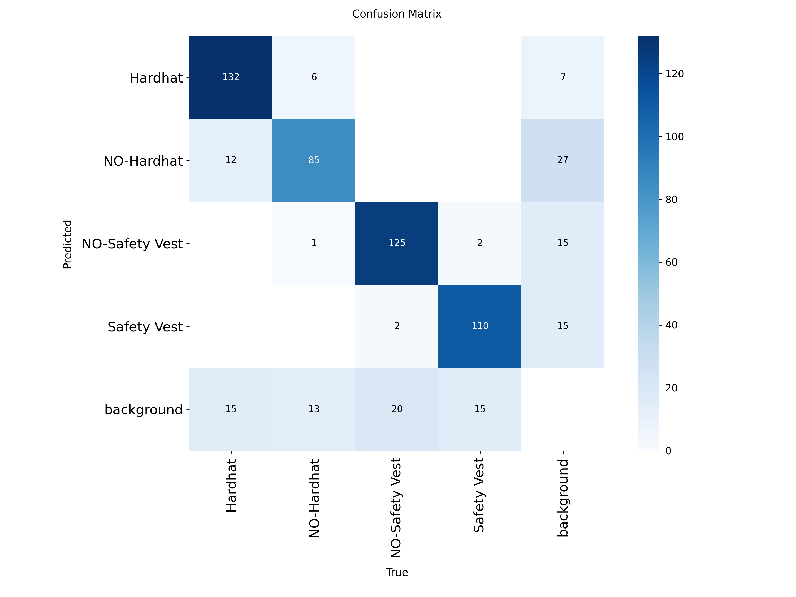
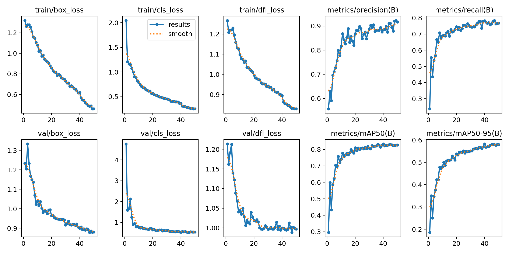

# 🏗️ Autonomous Occupational Health and Safety (OHS) Audit System | Otonom İSG Denetim Sistemi

[**EN: Project Details**](#en-project-details) | [**TR: Proje Detayları**](#tr-proje-detaylari)

---

<a name="en-project-details"></a>
## 🇬🇧 English Project Details

### 📝 About the Project

This project was developed as an Information Systems Engineering Capstone Project. It aims to automate Occupational Health and Safety (OHS) inspections in construction and industrial production sites. The system inspects employees' use of Personal Protective Equipment (Hardhats and Safety Vests) via real-time video streams, detects violations, and reports them through an asynchronous web-based dashboard.

### ✨ Key Features

* **Real-Time Detection (YOLOv8):** Equipment detection using a deep learning model trained on a custom construction site dataset (2718 images).

* **Zero Flickering & Strict Verification:** Integration of the **ByteTrack** algorithm and a custom-built 15-frame "Temporal Patience" filter (Heuristic Logic) to prevent instantaneous detection errors and false positives.

* **Autonomous Reporting:** An asynchronous Flask web interface where live camera streams can be monitored and violations are logged dynamically.

### 📊 Performance Metrics

The model is optimized to tolerate the physical challenges of the construction environment (lighting changes, complex backgrounds).

* **Real-Time Inference:** **15-20 FPS** on standard hardware.

* **Overall Accuracy (mAP@50):** **88.8%** mean average precision across all classes.

* **Hardhat Detection Sensitivity (Recall):** **91.03%** net accuracy.

<div align="center">
  
  
</div>

### 📂 Project Architecture (Directory Structure)

The project is built on a modular structure (Separation of Concerns):

```text
cv-ppe-detection-project/
├── data/                  # Dataset configuration (data.yaml)
├── docs/                  # Training graphics/metrics
│   ├── graphics/
│   └── results.csv
├── notebooks/             # Jupyter notebooks used for model training
├── outputs/               # Violation evidence images and logged violations (.csv)
├── src/                   # Core AI Algorithms
│   ├── camera.py          # Video streaming and frame processing
│   ├── config.py          # System configurations
│   ├── detector.py        # YOLO model and inference mechanism
│   ├── logger.py          # Violation logging system
│   ├── rules.py           # 15-frame Heuristic Logic rules
│   └── violation_tracker.py # ByteTrack and violation tracking integration
├── static/                # Frontend static assets
│   ├── css/
│   ├── images/
│   └── js/
├── templates/             # Flask HTML templates (Dashboard UI)
│   ├── about.html
│   ├── base.html
│   ├── camera.html
│   ├── index.html
│   ├── reports.html
│   └── video.html
├── test_videos/           # Sample construction videos for testing
├── weights/               # Trained custom YOLOv8 weights (.pt)
├── app.py                 # Flask web server main launcher
├── main.py                # System integration
├── requirements.txt       # Required Python libraries
└── test_env.py            # Environment test module
```

### 🛠️ Installation and Execution

```bash
# 1. Clone the repository
git clone [https://github.com/tunahantarhan/cv-ppe-detection-project.git](https://github.com/tunahantarhan/cv-ppe-detection-project.git)
cd cv-ppe-detection-project

# 2. Create and activate a virtual environment
python -m venv venv
venv\Scripts\activate  # For Mac/Linux: source venv/bin/activate

# 3. Install requirements
pip install -r requirements.txt

# 4. Launch the server
python app.py

# 5. Navigate to http://127.0.0.1:5001/ on your browser
```

---

<a name="tr-proje-detaylari"></a>
## 🇹🇷 Türkçe Proje Detayları

### 📝 Proje Hakkında

Bu proje, şantiye ve endüstriyel üretim sahalarındaki İş Sağlığı ve Güvenliği (İSG) denetimlerini otonomlaştırmak amacıyla Bilişim Sistemleri Mühendisliği Lisans Bitirme Projesi olarak geliştirilmiştir. Sistem; gerçek zamanlı video akışları üzerinden personelin Kişisel Koruyucu Donanım (Baret ve Yelek) kullanımını denetler, ihlalleri tespit eder ve asenkron web tabanlı bir arayüzle raporlar.

### ✨ Öne Çıkan Özellikler

* **Gerçek Zamanlı Tespit (YOLOv8):** Özgün bir şantiye veri setiyle (2718 görsel) eğitilmiş derin öğrenme modeli ile otonom donanım tespiti.

* **Sıfır Titreme & Kesin Doğrulama:** Anlık algılama hatalarını (flickering) önlemek için **ByteTrack** algoritması ve sisteme özel yazılmış 15-karelik "Zamansal Sabır" (Heuristic Logic) filtresi.

* **Otonom Raporlama & İzleme:** Flask asenkron altyapısıyla geliştirilen web arayüzü sayesinde (Dashboard) anlık kamera akışı izleme ve ihlal kayıtlarını loglama.

### 📊 Performans Metrikleri

Model, şantiye ortamının fiziksel zorluklarını (ışık değişimleri, karmaşık arka plan) tolere edebilecek şekilde optimize edilmiştir.

* **Gerçek Zamanlı Çıkarım:** Standart donanımlarda **15-20 FPS**

* **Genel Başarı (mAP@50):** Tüm sınıflarda ortalama **%88.8** hassasiyet.

* **Baret Tespit Duyarlılığı (Hardhat Recall):** **%91.03** net doğruluk.

<div align="center">
  
  
</div>

### 📂 Proje Mimarisi (Directory Structure)

Proje, sürdürülebilirlik prensiplerine uygun olarak modüler bir yapıda inşa edilmiştir:

```text
cv-ppe-detection-project/
├── data/                  # Etiketlenmiş veri seti yapılandırması (data.yaml)
├── docs/                  # Eğitim grafikleri/metrikleri
│   ├── graphics/
│   └── results.csv
├── notebooks/             # Model eğitiminde kullanılan Jupyter notebooklar
├── outputs/               # İhlal kanıt görselleri ve ihlallerin loglandığı .csv dosyası
├── src/                   # Çekirdek Yapay Zeka Algoritmaları
│   ├── camera.py          # Video akışı ve görüntü işleme
│   ├── config.py          # Sistem konfigürasyonları
│   ├── detector.py        # YOLO modeli ve çıkarım mekanizması
│   ├── logger.py          # İhlal kayıt sistemi
│   ├── rules.py           # 15-karelik Heuristic Logic kuralları
│   └── violation_tracker.py # ByteTrack ve ihlal takip entegrasyonu
├── static/                # Arayüz statik dosyaları
│   ├── css/
│   ├── images/
│   └── js/
├── templates/             # Flask HTML şablonları (Dashboard UI)
│   ├── about.html
│   ├── base.html
│   ├── camera.html
│   ├── index.html
│   ├── reports.html
│   └── video.html
├── test_videos/           # Model testi için örnek şantiye videoları
├── weights/               # Eğitilmiş özel YOLOv8 ağırlıkları (.pt)
├── app.py                 # Flask web sunucusu ana başlatıcısı
├── main.py                # Sistem entegrasyonu
├── requirements.txt       # Gerekli Python kütüphaneleri
└── test_env.py            # Çevre değişkenleri test modülü
```

### 🛠️ Kurulum ve Çalıştırma

```bash
# 1. Repoyu klonlayın
git clone [https://github.com/tunahantarhan/cv-ppe-detection-project.git](https://github.com/tunahantarhan/cv-ppe-detection-project.git)
cd cv-ppe-detection-project

# 2. Sanal ortam oluşturun ve aktif edin
python -m venv venv
venv\Scripts\activate  # Mac/Linux için: source venv/bin/activate

# 3. Kütüphaneleri yükleyin
pip install -r requirements.txt

# 4. Sunucuyu başlatın
python app.py

# 5. Tarayıcınızdan http://127.0.0.1:5001/ adresine gidin
```

---

## 👤 Author / Geliştirici

**Tunahan TARHAN**

* LinkedIn: [Tunahan Tarhan](https://www.linkedin.com/in/tunahan-tarhan/)
